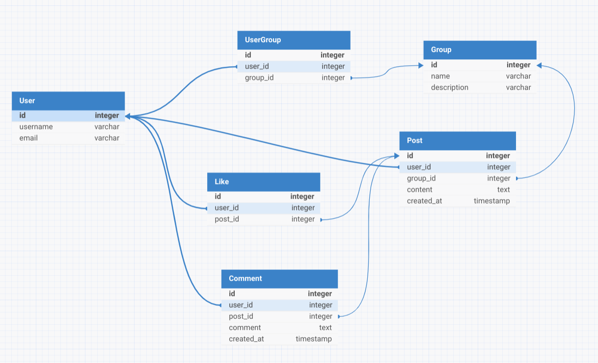

# Social App - Spring Boot Application

This is a simple social media application built using Spring Boot and SQLite. It allows users to join groups, create
posts, like posts, and comment on posts.

## Prerequisites

- Java 21
- Maven 3.6+
- SQLite (No setup required as the database file will be created automatically)

## Getting Started

### 1. Clone the Repository

```bash
git clone https://github.com/mdamaan00/social-app-spring-boot.git
cd social-app-spring-boot
```

### 2. Build the Project

Make sure you are in the project root directory, and run the following Maven command to build the project:

```bash
mvn clean install
```

### 3. Run the Application

After the project is built, you can run the Spring Boot application with the following command:

```bash
mvn spring-boot:run
```

### 4. Running the Application from the JAR

Alternatively, you can run the application from the JAR file:

```bash
java -jar target/social-app-spring-boot-0.0.1-SNAPSHOT.jar
```

### 5. Access the Application

Once the application starts, it will run on [http://localhost:8080](http://localhost:8080).

### 6. Using SQLite Database

The application uses an embedded SQLite database. By default, the SQLite file will be created at the root of the project
folder named `database.db`.

To view the database contents, you can use any SQLite browser or CLI tool:

```bash
sqlite3 database.db
```

## API Endpoints

You can access swagger UI for better view of the
API's [http://localhost:8080/swagger-ui/index.html](http://localhost:8080/swagger-ui/index.html)

## Technologies Used

- **Spring Boot**: For building the backend APIs
- **SQLite**: For the database
- **Hibernate**: As the JPA implementation
- **Lombok**: To reduce boilerplate code for models
- **Maven**: For build automation

## Database Schema

The database schema is automatically generated by Hibernate when the application starts.

- **User**: Represents users of the application
- **Post**: Represents posts in the system
- **Comment**: Represents comments on posts
- **Like**: Represents likes on posts
- **Group**: Represents groups that users can join
- **UserGroup**: Represents many to many relationship of user and group


